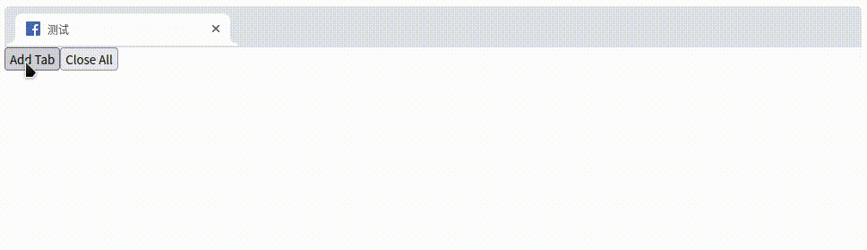

# React Chrome Tabs



[codesandbox](https://codesandbox.io/embed/eager-galois-hq8uxb?fontsize=14&hidenavigation=1&theme=dark)

## Installation

> yarn add @sinm/react-chrome-tabs
## Usage

```tsx
import { Tabs, TabProperties } from "@sinm/react-chrome-tabs";
import '@sinm/react-chrome-tabs/css/chrome-tabs.css';

const [tabs, setTabs] = useState<TabProperties[]>([
  { id: "abc", favicon: fb, title: "测试", active: true },
]);

<Tabs
  onTabClose={close}
  onTabReorder={reorder}
  onTabActive={active}
  tabs={tabs}
/>
```

## Example

```tsx
import React, { useEffect } from "react";
import { useState } from "react";
import { Tabs, TabProperties } from "@sinm/react-chrome-tabs";
import '@sinm/react-chrome-tabs/css/chrome-tabs.css';
// for dark mode
import '@sinm/react-chrome-tabs/css/chrome-tabs-dark-theme.css';

import fb from "./images/facebook-favicon.ico";
import google from "./images/google-favicon.ico";

let id = 1;

function App() {
  const [tabs, setTabs] = useState<TabProperties[]>([
    { id: "abc", favicon: fb, title: "测试", active: true },
  ]);

  const addTab = () => {
    id++;
    setTabs([
      ...tabs,
      {
        id: `tab-id-${id}`,
        title: `New Tabs ${id}`,
        favicon: tabs.length % 2 ? fb : google,
      },
    ]);
  };

  const active = (id: string) => {
    setTabs(tabs.map((tab) => ({ ...tab, active: id === tab.id })));
  };

  const close = (id: string) => {
    setTabs(tabs.filter((tab) => tab.id !== id));
  };

  const reorder = (tabId: string, fromIndex: number, toIndex: number) => {
    const beforeTab = tabs.find(tab => tab.id === tabId);
    if (!beforeTab) {
        return;
    }
    let newTabs = tabs.filter(tab => tab.id !== tabId);
    newTabs.splice(toIndex, 0, beforeTab);
    setTabs(newTabs);
  };
  const closeAll = () => setTabs([]);
  return (
    <div>
      <Tabs
        darkMode={false}
        onTabClose={close}
        onTabReorder={reorder}
        onTabActive={active}
        tabs={tabs}
        pinnedRight={<button onClick={addTabWithIcon}>+</button>}
      ></Tabs>
      <button onClick={addTab}>Add Tab</button>
      <button onClick={closeAll}>Close All</button>
    </div>
  );
}
```

More Examples see

- [Demo Code](./demo/index.tsx)
- [ONote Tabs](https://github.com/pansinm/ONote/blob/master/packages/renderer/src/main/containers/ResourceTabs/index.tsx)


## Component Props

| name          | type          | description                     |
| ------------- | ------------- | ------------------------------- |
| darkMode      | boolean       | dark mode                       |
| className     | string        | class name for tabs container   |
| tabs          | TabProperties | tabs to render                  |
| onTabActive   | Function      | when tab active                 |
| onTabClose    | Function      | when tab close                  |
| onTabReorder  | Function      | when tab drag to reorder        |
| onContextMenu | Function      | when trigger context menu event |

## TabProperties
```ts
export interface TabProperties {
  id: string;
  title: string;
  active?: boolean;
  // favicon background image
  favicon?: boolean | string;
  // favicon class
  faviconClass?: string;
}
```

## Run Demo
```bash
git clone https://github.com/pansinm/react-chrome-tabs.git
cd react-chrome-tabs
yarn start
# visit http://localhost:8080/
```
